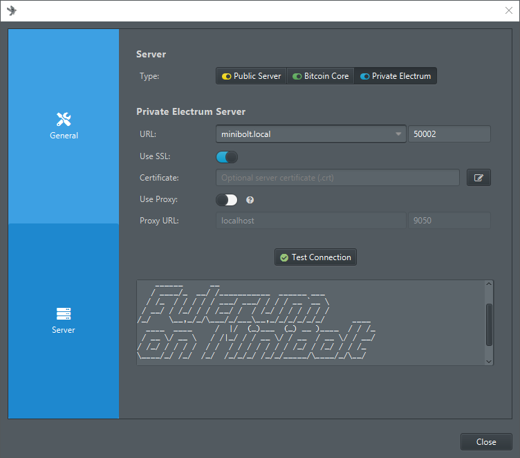
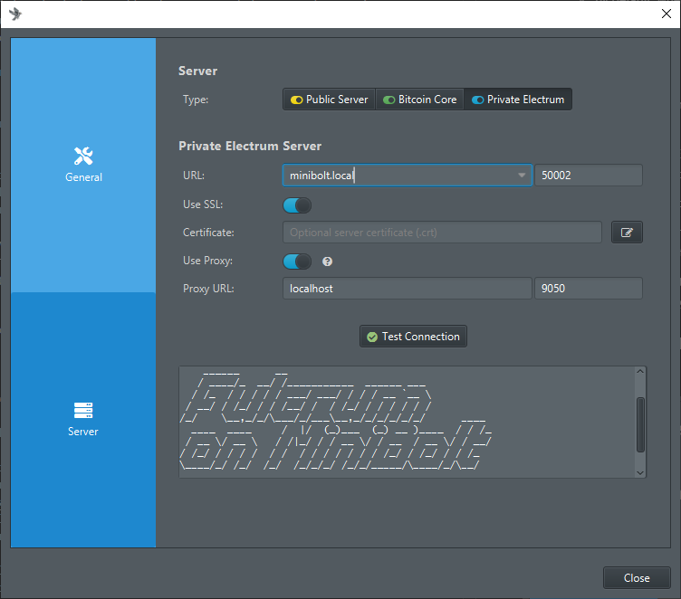

<!-- markdownlint-disable MD014 MD022 MD025 MD033 MD040 -->

# Desktop wallet

{: .no_toc }

Table of contents
{: .text-delta }

1. TOC
{:toc}

---

We install [Sparrow Wallet](https://github.com/sparrowwallet/sparrow){:target="_blank"} on a computer and connect it to your Electrum server on your node for private bitcoin on-chain transactions.  


---

## Table of contents
{: .no_toc .text-delta }

1. TOC
{:toc}

---

## Introduction

Sparrow Wallet is an excellent software wallet to use with your RaspiBolt: it's reliable and transparently shows what it's doing under the hood.

You can also use the following alternatives instead of Sparrow Wallet, according to your preferences and needs:

* [BitBoxApp](../bonus/bitcoin/bitboxapp.md): wallet for users of BitBox hardware wallets
* [Electrum](../bonus/bitcoin/electrum.md): a well-established poweruser wallet
* [Ledger Live](https://support.ledger.com/hc/en-us/articles/360017551659-Setting-up-your-Bitcoin-full-node?docs=true){:target="_blank"}: wallet for users of Ledger hardware wallets (this wallet connects directly to Bitcoin Core)
* [Specter Desktop](../bonus/bitcoin/specter-desktop.md): a multisig-focused wallet (this wallet connects directly to Bitcoin Core)
* [Trezor Suite](https://blog.trezor.io/connecting-your-wallet-to-a-full-node-edf56693b545?gi=d1e285f3d3c5){:target="_blank"}: wallet for users of Trezor hardware wallets

We will connect Sparrow Wallet to our own Electrum server as it is the most private option. For more information about the privacy and security trade-offs of the various server connection options, read the following [article](https://www.sparrowwallet.com/docs/best-practices.html){:target="_blank"} by Craig Raw, the author of the wallet.


We will set up Sparrow to connect to Electrs within your local network. There is also an optional section at the end that explains how to connect Sparrow to Electrs using Tor for when you're on the move.

Sparrow also connects to a couple of external services to get the Bitcoin price and communicate with the Whirlpool server during CoinJoin operations. By default, it uses clearnet which leaks your computer IP address to these services and degrade your privacy. However, Sparrow can also connect to them using a Tor proxy. There is an optional section at the end that explains how to set this proxy up.

---

## Installation

On your local computer, download, verify and install Sparrow Wallet.

* [Using the instructions on this page](https://www.sparrowwallet.com/download/){:target="_blank"}: 
  * Download the required version for your OS
  * Download the manifest and manifest signature files
  * Verify the release
  * Install Sparrow Wallet

---

## Local connection

We now configure Sparrow to connect to your node within your local network.

### Launch Sparrow

* Launch Sparrow
* Read carefully the introductory messages and click on "Next" several times
* When you reach the "Connecting to a Private Electrum Server" message, click on "Configure Server"

### Connect to Electrs

* Click on the "Private Electrum" tab
* On the "URL" line, paste `raspibolt.local` or your node IP (e.g., `192.168.0.20`) in the first box and `50002` in the second box
* Enable SSL by clicking on the slider
* Click on "Test Connection". A green tick should appear on the button and you should see something similar to the following output:

  ```
  > Connected to electrs/0.9.5 on protocol version 1.4
  > [...]
  ```



If there is a connection error message, try the following troubleshooting:

* Make sure that your computer is not connected to any "guest" WiFi network at home. A "guest" WiFi network prevents the computer to connect to any other devices on the local network, such as your node.
* If you have used Sparrow Wallet before on this computer, try to connect again after deleting the existing certificates that are stored within the `certs` folder:
  * On Windows: `C:\Users\<username>\AppData\Roaming\Sparrow\certs`
  * On macOS: `~/.sparrow/certs`
  * On Linux: `~/.sparrow/certs`

Let's go back to the wallet and check that it is connected to our own Electrum server.

* Close the server configuration window
* Check the icon in the bottom right corner of the wallet window 
  * The icon should be a blue slider button and a mouse over should display "Connected to [...] at height [...]"

You're set! Sparrow is now configured to connect to your Electrum server from within your local network.

For maximal privacy, we highly recommend that you set up the Tor proxy when using Sparrow within your local network over clearnet. Check the [optional section](#optional-set-up-a-tor-proxy-for-external-services) at the end of this guide.

---

## Sparrow in action

Congratulations, you have now a Bitcoin desktop wallet, capable of securing your bitcoin, running with your own trustless Bitcoin full node!  
Sparrow is a powerful wallet that allows you to use the most advanced features for securing your bitcoins and preserve your privacy.

With Sparrow you can:

* Connect any hardware wallet
* Send and receive bitcoins
* Have full control throughout the transaction creation and signing process: coin control, PSBT, labelling, byte level transaction viewer...
* Create batched transactions to save on miner fees
* Create multisig wallets for improved security
* Coinjoin your coins for improved privacy
* Analyse your tansactions with the built-in blockchain explorer

For more information, tutorials and support, visit the [Sparrow documentation webpage](https://sparrowwallet.com/docs/){:target="_blank"} and their [Telegram group](https://t.me/sparrowwallet){:target="_blank"}.

---

## (Optional) Remote connection over Tor

If you want to use Sparrow outside your home network, when you're on the go, you can use a connection over Tor.

### Server Tor address

To connect via Tor to Electrs, the server must have a Tor hidden service connection address. Make sure you have set up a Tor hidden service as explained in the ["Electrum server" guide](electrum-server.md#remote-access-over-tor-optional).

If you've already set up the hidden service but lost the connection address, 
you can obtain it again by running the following command with "admin" on your node:

  ```
  $ sudo cat /var/lib/tor/hidden_service_electrs/hostname`
  > abcd...1234.onion
  ```

### Sparrow configuration

* Open Sparrow
* Navigate to the server configuration page by hitting `Ctrl`+`P`, or  `Cmd`+`,` on OSX, then click on "Server"
* Click on the "Private Electrum" tab. If you've already have an existing clearnet connection, click on "Edit Existing Connection".
* On the "URL" line, paste your Tor hidden service connection address (e.g. "abcd...1234.onion") in the first box and `50002` in the second box
* Enable SSL by clicking on the slider
* Click on "Test Connection". A green tick should appear on the button and you should see something similar to the following output:

  ```
  > Connected to [...] on protocol version 1.4
  > [...]
  ```


You're set! Sparrow is now configured to connect to your node over Tor and you can use it wherever you are.

---

## (Optional) Set up a Tor proxy for external services

If a Tor proxy is configured in Sparrow, all external connections use Tor. This includes rate fetching, coinjoin etc - even transaction broadcasting is then done via external service (like blockstream.info) over Tor for additional privacy. Where-ever possible, the onion URLs of these services are used.

Sparrow can be configured to use an internal (bundled) or external Tor proxy. To use the internal proxy, an onion Electrum server URL must be specified, and the 'Use Proxy' toggle must be off. Therefore, the following section only applies if you connect to your Electrum server using the local IP address within your local network (e.g., `raspibolt.local` or `192.168.0.20`). If you're using a Tor onion address to connect to your node, then Sparrow is already using the internal proxy and there is nothing else to be done!

If you're using a local connection, we recommend that you set up this external Tor proxy as described below for maximal privacy.

### Preparations on your computer

For Sparrow Wallet to connect to the external services via Tor, Tor has to be running on your computer. You can run the Tor Browser and use port 9150 on localhost or else run Tor as a background service and use port 9050.

Here, we'll use the Tor Browser and port 9150 as it is easier to set up on Windows and macOS.

* Install the Tor Browser on your computer by following [this guide](https://tb-manual.torproject.org/installation/){:target="_blank"}.
* Launch the Tor Browser
* Click on "Always connect automatically" and "Connect"
* Keep the Tor Browser running while using Sparrow

*Note:* For Linux Debian-based OS users, you might prefer to just have Tor running in the background and not have to open the Tor Browser each time you're using Sparrow Wallet. If so, instead of intalling the browser, simply install Tor with `sudo apt install tor` and check that it is running with `systemctl status tor`. Remember that when using the Tor daemon, the Tor proxy will communicate on port 9050.

### Wallet configuration

* Open Sparrow
* Navigate to the server configuration page by hitting `Ctrl`+`P`, or  `Cmd`+`,` on OSX, then click on "Server"
* Click on the "Private Electrum" tab. If you've already have an existing clearnet connection, click on "Edit Existing Connection".
* Enable the Tor proxy by clicking on the "Use proxy" slider
* On the "Proxy URL" line, paste `127.0.0.1` in the first box and either `9150` or `9050` in the second box depending if you run the Tor Browser or Tor as a background service.
* Click on "Test Connection". A green tick should appear on the button and you should see something similar to the following output:

  ```
  > Connected to [...] on protocol version 1.4
  > [...]
  ```



Now, let's go back to the wallet and check that the proxy is working properly.

* Close the server configuration window
* Check the two icons in the bottom right corner of the wallet window 
  * The first icon should be grey, not red; and a mouse hover should display "External Tor proxy enabled"

You're set! Sparrow Wallet is now configured to use the Tor proxy when fetching the Bitcoin price and when communicating with the Whirlpool server during CoinJoins.

---

## For the future: Sparrow update

Sparrow will automatically notify you when an update is available. Simply install the updates using the usual method for your OS.

<br /><br />

---

Next: [Blockchain explorer >>](blockchain-explorer.md)
