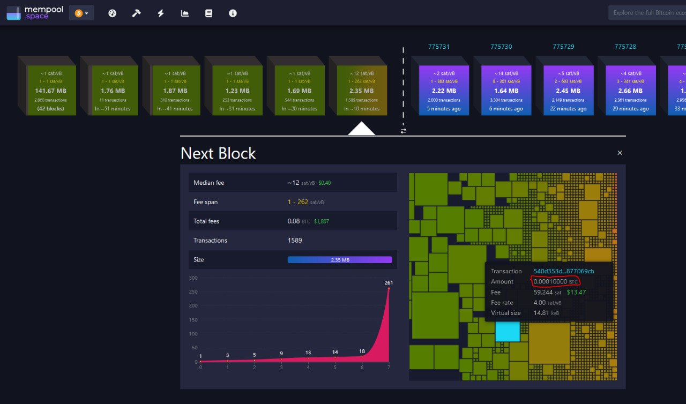
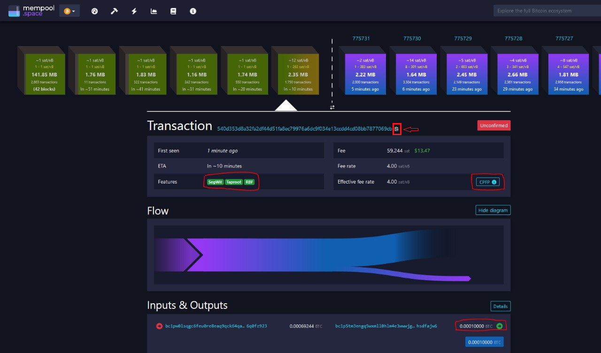

<!-- markdownlint-disable MD014 MD022 MD025 MD033 MD040 -->

# Bonus guide: Ordisrespector spam filter

{: .no_toc }

---

[Ordinals](https://ordinals.com/) is a project created to number sats. It also has a feature called inscriptions, which is the problematic part and what is mainly being touched on in this guide. An inscription is basically data stored on chain associated with a sat.

Difficulty: Medium
{: .label .label-yellow }

Status: Tested MiniBolt
{: .label .label-blue }


---

## Table of contents
{: .no_toc .text-delta }

1. TOC
{:toc}

---

## Context

Why are they an attack on Bitcoin?

First of all, we probably should look at what Bitcoin is:

> A Peer-to-Peer Electronic Cash System [(Bitcoin Whitepaper)](https://bitcoin.org/bitcoin.pdf)

There is no mention of data storage on the chain and only financial transactions.
Ordinals abuse the Bitcoin timechain which was meant to process financial transactions to store data, and this has some issues, such as:

- Pushing out financial transactions, such as ones that need immediate confirmation such as force closes with pending HTLCs or a sweep-all TX.
- Driving up fee rates for the sole reason of inscribing a JPEG.
- It makes it way more expensive to maintain their node in the long term.
- It makes them liable for any illegal content in their jurisdiction that they store on their disk and broadcast freely.

...while paying 4x less for the same bytes.

[Ordisrespector](https://twitter.com/oomahq/status/1621899175079051264){:target="_blank"} is a ***spam patch filter*** that works by detecting the pattern of Ordinals transactions that are entering the mempool of the node and ***rejecting them***. The original patch was created by Luke Dashjr, you can see it here: [https://gist.github.com/luke-jr/4c022839584020444915c84bdd825831](https://gist.github.com/luke-jr/4c022839584020444915c84bdd825831) ([Archive](https://web.archive.org/web/20230207212859/https://gist.github.com/luke-jr/4c022839584020444915c84bdd825831))

🔎 More info and original text on: [https://ordisrespector.com](https://ordisrespector.com) by [Semisol](https://twitter.com/semisol_public)

## Preparations

> 💡 You enter commands and the PC answers by printing the results below your command. To clarify where a command begins, every command in this guide starts with the `"$"` sign. The system response is marked with the `">"` character.

* Login as `"admin"` user (for a MiniBolt environment), or your assigned user with `sudo` permissions

* Update and upgrade your OS

  ```sh
  $ sudo apt update && sudo apt full-upgrade
  ```

* Set the next environment variable

  ```sh
  $ VERSION=24.0.1
  ```

* Install the next dependencies packages

  ```sh
  $ sudo apt-get install autoconf automake build-essential libboost-filesystem-dev libboost-system-dev libboost-thread-dev libevent-dev libsqlite3-dev libtool pkg-config libzmq3-dev --no-install-recommends
  ```

## Installation

* Change to the temporary directory which is cleared on reboot

  ```sh
  $ cd /tmp
  ```

* Get the latest source code, the list of cryptographic checksums and the signatures attesting to validity of the checksums

  ```sh
  $ wget https://bitcoincore.org/bin/bitcoin-core-$VERSION/bitcoin-$VERSION.tar.gz
  ```

  ```sh
  $ wget https://bitcoincore.org/bin/bitcoin-core-$VERSION/SHA256SUMS
  ```

  ```sh
  $ wget https://bitcoincore.org/bin/bitcoin-core-$VERSION/SHA256SUMS.asc
  ```

### **Checksum check**

* Check that the reference checksum in file `SHA256SUMS` matches the checksum calculated by you (ignore the "lines are improperly formatted" warning)

  ```sh
  $ sha256sum --ignore-missing --check SHA256SUMS
  ```

Expected output:

  ```sh
  > bitcoin-$VERSION.tar.gz: OK
  ```

### **Signature check**

Bitcoin releases are signed by several individuals, each using its own key. To verify the validity of these signatures, you must first import the corresponding public keys into your GPG key database.

* The next command download and imports automatically all signatures from the [Bitcoin Core release attestations (Guix)](https://github.com/bitcoin-core/guix.sigs) repository

  ```sh
  $ curl -s "https://api.github.com/repositories/355107265/contents/builder-keys" | grep download_url | grep -oE "https://[a-zA-Z0-9./-]+" | while read url; do curl -s "$url" | gpg --import; done
  ```

Expected output:

  ```
  > gpg: key 17565732E08E5E41: 29 signatures not checked due to missing keys
  > gpg: /home/admin/.gnupg/trustdb.gpg: trustdb created
  > gpg: key 17565732E08E5E41: public key "Andrew Chow <andrew@achow101.com>" imported
  > gpg: Total number processed: 1
  > gpg:               imported: 1
  > gpg: no ultimately trusted keys found
  [...]
  ```

* Verify that the checksums file is cryptographically signed by the release signing keys.

The following command prints signature checks for each of the public keys that signed the checksums.

  ```sh
  $ gpg --verify SHA256SUMS.asc
  ```

* Check that at least a few signatures show the following text

Expected output:

  ```sh
  > gpg: Good signature from ...
  > Primary key fingerprint: ...
  [...]
  ```

* If you're satisfied with the checksum, signature and timestamp checks, extract the Bitcoin Core source code, install them and check the version.

  ```sh
  $ tar -xvf bitcoin-$VERSION.tar.gz
  ```

### **Build it from the source code**

* Build BerkeleyDB 4.8 to allow for legacy wallets, necessary to use JoinMarket, Electrum Personal Server, and possibly other tools:

  ```sh
  $ wget -O bdb.sh https://raw.githubusercontent.com/bitcoin/bitcoin/aef8b4f43b0c4300aa6cf2c5cf5c19f55e73499c/contrib/install_db4.sh
  $ chmod +x bdb.sh
  $ ./bdb.sh bitcoin-$VERSION
  ```

* Enter the Bitcoin Core source code folder

  ```sh
  $ cd bitcoin-$VERSION
  ```

* Execute the next command

  ```sh
  $ ./autogen.sh
  ```

* The next command will pre-configure the installation, we will discard some features and include others. Enter the complete next command in the terminal and press enter

  ```sh
  export BDB_PREFIX="/tmp/bitcoin-$VERSION/db4"
  ./configure \
     BDB_LIBS="-L${BDB_PREFIX}/lib -ldb_cxx-4.8" BDB_CFLAGS="-I${BDB_PREFIX}/include" \
    --disable-bench \
    --disable-gui-tests \
    --disable-maintainer-mode \
    --disable-man \
    --disable-tests \
    --with-daemon=yes \
    --with-gui=no \
    --with-qrencode=no \
    --with-utils=yes
  ```

### **Apply the patch "Ordisrespector"**

* Download the Ordisrespector patch

  ```sh
  $ wget https://raw.githubusercontent.com/twofaktor/minibolt/main/resources/ordisrespector.patch
  ```

* Inspect `ordisrespector.patch` file to make sure it does not do bad things. If you see all OK, exit with Ctrl-X and continue with the next command

  ```sh
  $ nano ordisrespector.patch
  ```

* Apply the patch

  ```sh
  $ git apply ordisrespector.patch
  ```

### **Build**

* Enter the command to compile

  ```sh
  $ make -j$(nproc)
  ```

💡 This process can take quite a long time, 10-15 minutes or more, depending on the performance of your device. Please be patient until the prompt shows again.

### **Install**

* Enter the next command to install the new binaries precompiled for yourself on the OS

  ```sh
  $ sudo make install
  ```

* Restart your existing Bitcoin Core using the systemd or start a new instance with the Ordisrespector patch change

  ```sh
  $ sudo systemctl restart bitcoind
  ```

* Monitor by the systemd journal and check the logging output. You can exit monitoring at any time with Ctrl-C

  ```sh
  $ sudo journalctl -f -u bitcoind
  ```

### **How to detect Ordinals transactions**

> 💡 After start Bitcoin Core, wait a few minutes for Bitcoin Core to load the mempool, the indicator for this is the log: ***"Imported mempool transactions from disk: ..."***. It is possible that a rather high indicator of "failed" imported transactions has appeared, which is a good sign, it's the filter is taking effect and rejecting Ordinals transactions 😃

* Go to the public mempool.space [clearnet](https://mempool.space) or [Tor](http://mempoolhqx4isw62xs7abwphsq7ldayuidyx2v2oethdhhj6mlo2r6ad.onion) link web page

* Click on the first mempool candidate blocks in the green/yellow color blocks


* Put the pointer above the cube's dynamic graphic at the bottom right, find a transaction with exactly **0.00010000 BTC** or **0.00005000 BTC** ***[NEW]*** output amount and click on the cube of the transaction to do a second verification



* Look for "Taproot", "Segwit", "RBF" and "CPFP" tags (this last doesn't appear always)



#### **Check the Ordisrespector filter working on your mempool**

* Click on the "copy to the clipboard" icon to copy the transaction id `(<txid>)`, and paste this on your own Bitcoin Explorer (BTC RPC Explorer / Mempool), in  a BTC RPC Explorer running on a MiniBolt environment, go to [https://minibolt.local:4000](https://minibolt.local:4000)

* Search the `"<txid>"` on the browser of your own Bitcoin Explorer

***Mempool space*** expected output:


***BTC RPC Explorer*** expected output:


Or if you prefer, check directly through the Bitcoin Core CLI command, doing

  ```sh
  $ bitcoin-cli getmempoolentry <txid>
  ```

Expected output:

  ```
  error code: -5
  error message:
  Transaction not in mempool
  ```

💡 The before information indicates that the filter is working properly

## Extras

### **Add Ordisrespector node peers (optional)**

Add ["Bitcoin Barcelona node"](https://bitcoinbarcelona.xyz/Nodo-Bitcoin-Barcelona-b275aaed964149a3ae2c9b1d16d6b78f) as a peer in your node, or Ordisrespector runners community peers that shared their public addresses, in this way it is easier to invade the network with Ordisrespector node runners.

* Edit and add on `"bitcoin.conf"` file the next line/s at the end of the file

  ```sh
  $ sudo nano /data/bitcoin/bitcoin.conf
  ```

If you have enabled the Tor network

  ```
  addnode=ots6ud7ovx6furs4sxlm7aze5q44qtoeapwcukelcxc3i2r5tkxgdlqd.onion:8333
  ```

If you have enabled the I2P network, add this line as well

  ```
  addnode=i2gu72r3tcmd5tuup53bauczdbvmylsoasvjxd56qobj7xhthxla.b32.i2p:0
  ```

<br /><br />

---

<< Back: [+ Bitcoin](index.md)
