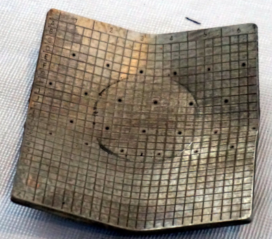
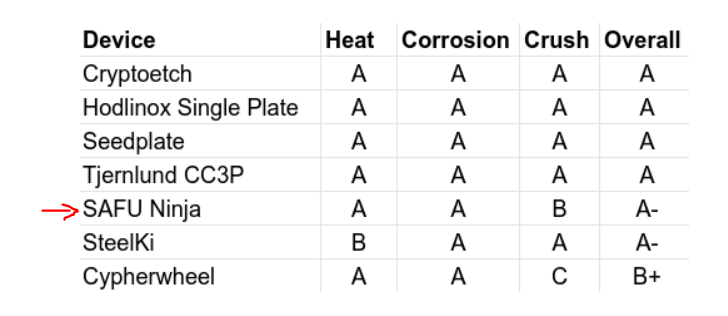

<!-- markdownlint-disable MD014 MD022 MD025 MD033 MD040 -->

# Bonus guide: Safu Ninja, a DIY steel mnemonic backup

{: .no_toc }

---

[Safu Ninja](https://safu.ninja/){:target="_blank"} is a DIY way to make resilient mnemonic word backups with off-the-shelf components for complete privacy.

Difficulty: Easy
{: .label .label-green }

Status: Tested MiniBolt
{: .label .label-blue }

---

## Table of contents
{: .no_toc .text-delta }

1. TOC
{:toc}

---

## Introduction

Practically, most onchain bitcoin wallets will ask you to save a list of 12 or 24 words as backup to recover your funds in case you lose the wallet password or your hardware wallet.

Technically, these words are known as "mnemonic words" and are used together with a salt to generate a "seed". The seed itself is hashed to derive your "master private key" and the "master chain code" which used for the various accounts in your HD wallet. You can read more about this process in [Chapter 5 of "Matering Bitcoin"](https://github.com/bitcoinbook/bitcoinbook/blob/develop/ch05.asciidoc#hd_wallets=){:target="_blank"}.

Now, because these words allow to reconstruct your wallet and recover your funds, they have to be kept very secure and never typed or saved in any computer or online device. That's why wallet provides usually advise users to write them down on a piece of paper, which is great from a security point of view.

But paper is easily destroyed by water, fire or even a pet that loves chewing things. Hence it is much better to store them on a much more resilient physical medium: e.g., steel. Various steel backup solutions have been created the last few years. You can find a comprehensive list of them and how they performed under stress tests on [Jameson Lopp's website](https://jlopp.github.io/metal-bitcoin-storage-reviews/){:target="_blank"}.

While great, most of these techniques have one major downside... they require you to buy from a company a ready-made item which sole use case is as a bitcoin mnemonics backup. Which means that the seller will know that you probably have some bitcoin... and worst, if their customer database get hacked, anyone could quickly know that you probably have some bitcoins.

Instead, it is more private and ultimately secure to build this steel mnemonics backup from off-the-shelf components that have not be designed for Bitcoin usage. Like you did with the RaspiBolt node vs buying a plug-and-play node!

For example, a popular DIY method relies on standard steel washers stacked and locked on a bolt. The mnemonic words and ordering numbers are punched on the washers using a metal stamp set. All the components can be found easily in a hardware shop or online and none are associated with Bitcoin usage. Simple and private.

As far as I know, Safu Ninja was the first one to come up with [this idea](https://www.reddit.com/r/Bitcoin/comments/h0j136/cheap_and_easy_diy_metal_bitcoin_seed_storage/){:target="_blank"} back in June 2020. You can check their [website](https://safu.ninja/){:target="_blank"}.

This metal backup has been stress tested by Jameson Lopp. Check his full review [here](https://blog.lopp.net/metal-bitcoin-seed-storage-stress-test-iv/){:target="_blank"} and below is a summary:

Let's get started!

---

## Hardware requirements

You will need the following hardware components:

* Stainless steel fender washers (e.g. M8)
* Stainless steel bolts and wingnuts (e.g. M8)
* Letter and number metal stamp set (e.g. 3 mm heigth)
* Hammer

Quantities are dependent on how many backups you plan to make and how many words there are in each backup (12 or 24 usually). One backup of 24 mnemonic words will require only one bolt and wingnut and 24 washers. Although, a few more would be useful for pratice or if you make mistakes while stamping.

The key thing is to make sure that all the sizes are compatible with each other:

* The washers must have the same inner diameter as the bolt
* The length of the bolt must be longer than the length of the stacked washers
* The metal stamps width must be smaller than the width of the washer metallic band

Also, if you want to punch more than one backup, make sure you get a stamp set that is hard enough to punch repeatedly into metal.

Note: Punching into the washers can be quite difficult at time. Because of this, some guides recommend using a [Blockmit washer jig](https://www.cryptocloaks.com/product/blockmitjig/){:target="_blank"}  to make it easier to hold the punch and create a tidier result. However, buying such an item make us go back to square one as it is not an off-the-shelf component! However, if you have a 3D printer, you could print it yourself by downloading the free [3D model](https://www.tinkercad.com/things/6LnKVMshm6o){:target="_blank"}.

---

## Instructions

* Make sure that you're punching your words in a private location without any cameras that could see the words (including your phone).

* Step 1: Punch the first word on a washer. It is better to punch the entire word, rather than just the first 4 letters. While the 4 first letters are sufficient to identify the unique word from the BIP 39 list of words... it removes some of the redundancy provided by the remaining letters. If the washer is damaged and the first two letters are not readable, you'll have more chance to identify the word if all the remaining letters of the word are present than if only the following 2 letters are present.

* Step 2: Punch the number corresponding to the position of the word on the list. This will help in case the washers get loose and mixed.

* Repeat step 1 and 2 above for all the remaining words

* (Optional) Punch the name of the wallet on a washer (e.g. "WALLET XY"). It might come handy in a few years to remember what wallet was associated with this backup and also because some wallets might use uncommon derivation paths. Check this [list of derivation paths](https://walletsrecovery.org/){:target="_blank"} supported by each wallet is maintained by @NVK and @J9Roem.

* (Optional) Punch the date of creation of your wallet, known as the "birth date". This could help you quicken the search for your UTXOs when reconstructing the wallet in a few years. The wallet software used for recovery will not need to scan the entire blockhain but will start at the birth date. This does not apply to LND onchain wallets which use the azeed cipher scheme that includes birth date in the mnemonic words.

* Stack all the washers on the bolt

* Screw and tighten the wingnut

You're set! You now have a DIY steel metal backup that will be resistant to fire, flood, schocks and other kind of environmental damages.

---

## Recovery

Below are a few pointers in case you need to use your backup to recover funds from one of your wallet.

Best practice is to NEVER enter your 24 recovery words on an online software or website unless it's just a very small amount that you don't mind putting at risk.

Instead, it is best to enter your mnemonic words into a dedicated and secure hardware wallet. Most hardware wallets have information on how to do just this on their website, make sure you have a look at these instructions BEFORE you have an emergency situation!

  

---

<< Back: [+ Bitcoin](index.md)
