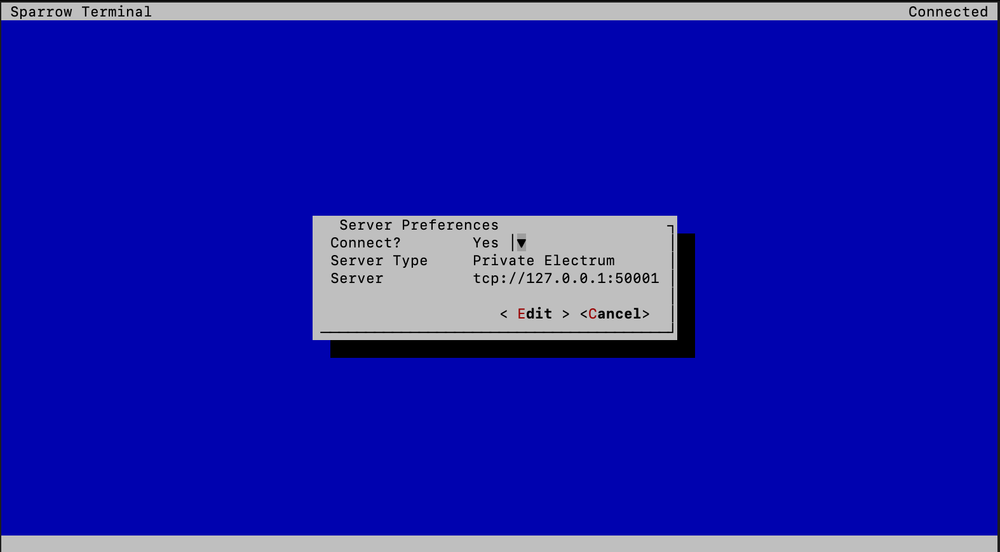

<!-- markdownlint-disable MD014 MD022 MD025 MD033 MD040 -->

## Bonus guide: Sparrow Server

{: .no_toc }

---

Sparrow Server is a stripped down version of Sparrow that can be run on systems without displays. It's primarily intended as a configuration utility for running Sparrow as a server daemon.

Difficulty: Medium
{: .label .label-yellow }

Status: Tested MiniBolt
{: .label .label-blue }


---

## Table of contents
{: .text-delta }

1. TOC
{:toc}

---

## Installation

### Download Sparrow Server

* With user "admin", download Sparrow Server and signatures into "/tmp" directory, which is cleared on the reboot.

  ```sh
  $ cd /tmp
  $ wget https://github.com/sparrowwallet/sparrow/releases/download/1.7.1/sparrow-server-1.7.1-x86_64.tar.gz
  $ wget https://github.com/sparrowwallet/sparrow/releases/download/1.7.1/sparrow-1.7.1-manifest.txt.asc
  $ wget https://github.com/sparrowwallet/sparrow/releases/download/1.7.1/sparrow-1.7.1-manifest.txt
  ```
  
* Import keys that signed the release

  ```sh
  $ curl https://keybase.io/craigraw/pgp_keys.asc | gpg --import
  ```
  
* Verify the release
  
  ```sh
  $ gpg --verify sparrow-1.7.1-manifest.txt.asc
  ```

  ```sh
  > gpg: assuming signed data in 'sparrow-1.7.1-manifest.txt'
  > gpg: Signature made Thu Nov 17 14:08:59 2022 GMT
  > gpg:                using RSA key D4D0D3202FC06849A257B38DE94618334C674B40
  > gpg: Good signature from "Craig Raw <craigraw@gmail.com>" [unknown]
  > gpg: WARNING: This key is not certified with a trusted signature!
  > gpg:          There is no indication that the signature belongs to the owner.
  > Primary key fingerprint: D4D0 D320 2FC0 6849 A257  B38D E946 1833 4C67 4B40
  ```
  
  ```sh
  $ sha256sum --check sparrow-1.7.1-manifest.txt --ignore-missing
  > sparrow-server-1.7.1-x86_64.tar.gz: OK
  ```

* If everything is correct, unpack Sparrow

  ```sh
  $ tar -xvf sparrow-server-1.7.1-x86_64.tar.gz
  ```

* Move data files to the home "admin" user

  ```sh
  $ sudo mv Sparrow /home/admin/
  ```

* Add the Sparrow executable to your PATH by creating a symlink to it within `/usr/local/bin`, which is already part of PATH.

  ```sh
  $ sudo ln -s /home/admin/Sparrow/bin/Sparrow /usr/local/bin/Sparrow
  ```

## Run Sparrow

* You can run Sparrow with the following command

  ```sh
  $ Sparrow
  ```


⚠️ Sparrow Server doesn't work on MobaXterm with X11-Forwarding enabled in the SSH connection.
  
* In the "wallet" tab you can create or restore your wallet

### Connect Sparrow to your backend (optional)

* Open Sparrow Wallet

  ```sh
  $ Sparrow
  ```

* Go to `Preferences > Server > Private Electrum > Continue`
* Set values according to your Electrum Server protocol implementation and test connection

  ```
  # For Fulcrum (TCP)
  URL: 127.0.0.1:50001
  Use SSL?: No
  
  # For Fulcrum (SSL)
  URL: 127.0.0.1:50002
  Use SSL?: Yes
  ```

* You are now connected to your own Electrum Server



## Mix Bitcoin with Sparrow Terminal

### Launch Sparrow using tmux

* Start a new tmux session called "Sparrow"

  ```sh
  $ tmux new -s sparrow_server
  ```

* Launch Sparrow Terminal

  ```sh
  $ Sparrow
  ```

* Connect Sparrow Terminal to your own Electrum Server implementation according to the steps above if not already done

### Create/import wallet

* Go to `Wallets > Create Wallet`

* Paste the seed words of the hot wallet you will mix bitcoin with. If you use for example Samourai Wallet - do not forget to paste the SW passphrase as well

* Create a strong password for the Sparrow Terminal wallet to prevent loss of funds in case of someone gets access to your node/wallet

* Open your Wallet

### Start mixing

* Send Bitcoin to your hot wallet if not already done

* Go to "UTXOs" and select the UTXOs you want to mix. Set Premix priority or fee rate

* Choose the pool you desire. If not sure, you can calculate which pool to use based on fees you will pay using [whirlpoolfees](https://www.whirlpoolfees.com/). It is recommended to use the most economical solution.

* Enter SCODE if available, and you will get a discount on the pool fee. You can monitor SCODEs by following the Samourai Wallets RRSS. SCODEs are shared occasionally at random by the Samourai Wallet developer team to give Whirpool participants discounted mixing fees

* Mix selected funds

* Once confirmed, go to `Accounts > Postmix > UTXOs > Mix To`

* You can mix to cold storage if desired. Select value for minimum mixes before sending to cold storage

* If you use Whirlpool with Dojo as well - set the Postmix index range to "odd". This way you improve your chances of getting into a mix by running two separate mixing clients at the same time, using different index ranges to prevent mix failures

### Detaching a session

* Detach tmux session to run ST in the background

1. Press `Ctrl + b` once
1. Press `d` once

Closing or logging out from your node without detaching would cause mixing to stop. ST now runs as a separate process regardless of your disconnecting from the node

* You can view tmux sessions using the following command

  ```sh
  $ tmux ls
  ```

* You can get back in sessions using

  ```sh
  $ tmux a
  ```

* Or use this if you have other sessions opened

  ```sh
  $ tmux a -t sparrow_server
  ```

## For the Future: Sparrow Server update

* Download and install Sparrow Server by following the [installation section](#installation), you will overwrite several files.

## Uninstall

### Delete Sparrow

* Delete Sparrow symlinks & directory

  ```sh
  $ sudo rm /usr/local/bin/Sparrow
  $ sudo rm -r /home/admin/Sparrow
  ```
  
<br /><br />

---

<< Back: [+ Bitcoin](index.md)
