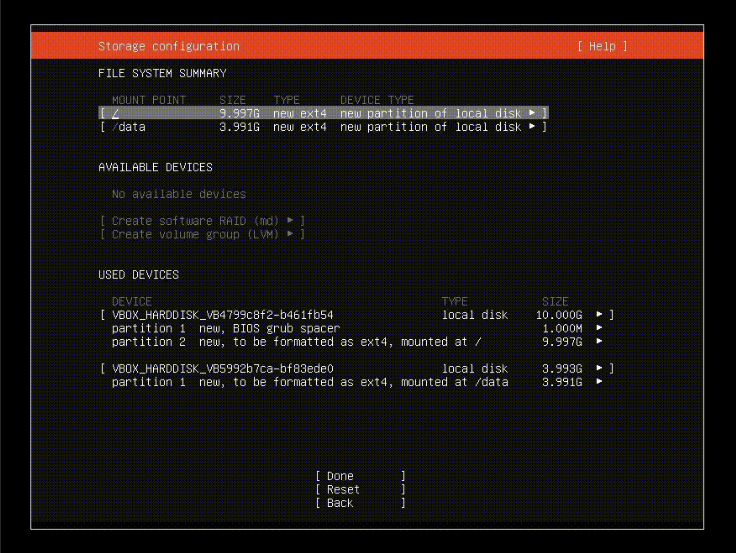

<!-- markdownlint-disable MD014 MD022 MD025 MD033 MD040 -->

# Bonus Guide: Store data in a secondary disk

{: .no_toc }

---

If you want to use a different disk to store data (blockchain and other databases) independently of the disk of the system, you can follow these instructions.

Difficulty: Easy
{: .label .label-green }

Status: Tested MiniBolt
{: .label .label-blue }

---

## Table of contents
{: .no_toc .text-delta }

1. TOC
{:toc}

---

## Storage configuration

When you arrive at the **"Guided storage configuration"** **(step 8)** on the [Ubuntu server installation](../../system/operating-system.md#ubuntu-server-installation), follow the next steps:

**8.2.** Pay attention to checking **"Custom storage layout"** instead of ~~Use an entire disk~~, select **"Done"** and press **enter**

📝 Under **AVAILABLE DEVICES** you will see both drives you installed on the PC, identify each one by **drive model name** and **storage**

💡 It is recommended to choose the **smallest size drive** for the system and the **bigger size drive** for the data storage **`(/data)`** (blockchain, databases, etc)

> **8.2.1.** Select the section where appeared the **MODEL** of the **primary disk** between `"[]"` and press enter -> Select **"Use As Boot Device"** and press **enter** again

💡 This will select this storage as the boot disk and create automatically a new partition for the **"BIOS grub spacer"** on it.

> **8.2.2.** Select the **"free space"** section of the same device, and select **"Add GPT Partition"**. Ensure the format is selected as **`"ext4"`**, select **`"/"`** in the dropdown as mount point, select **"Create"** and press **enter**

> **8.2.3.** Now select the **"free space"** of the **secondary disk** on "AVAILABLE DEVICES" -> **Add GPT partition**. Ensure the format is selected as `"ext4"`, select **"Other"** in the dropdown, type `/data` to assign to the new **("/data")** folder, select **"Create"** and press enter

**9.** Select **"Done"** and press enter. Confirm destructive action warning banner hitting **"Continue"**

🚨 **This will delete all existing data on the disks, including existing partitions!**

⚠️ The GIF above is a recreation of a scenario made with a virtual machine **-->** **VBOX_HARDDISK_***VB4***...** would be the **primary disk**, and **-->** **VBOX_HARDDISK_***VB5***...** would be the **secondary disk**. In your case, this probably **will not match exactly.**

## Continue with the guide

✔️ That's it: when you finish the [Operating system](../../system/operating-system.md) section, your PC will boot the system from the primary disk while the data directory **`(/data)`** will be located on the secondary disk.

**-->** Now you can continue with **step 10** of the [Ubuntu Server installation](../../system/operating-system.md#ubuntu-server-installation)

---

Next: [Ubuntu Server installation, step 10 >>](../../system/operating-system.md#ubuntu-server-installation)

<< Back: [+ System](index.md)
