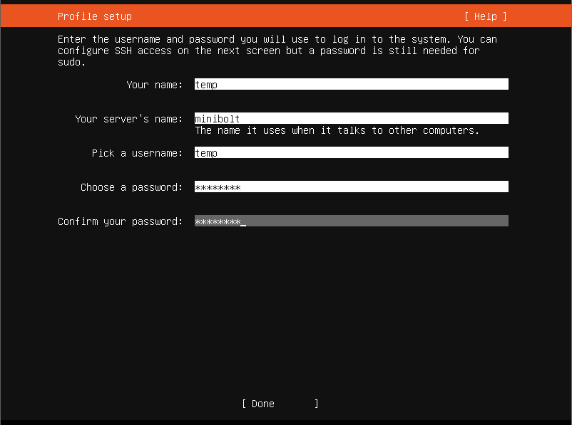

<!-- markdownlint-disable MD014 MD022 MD025 MD033 MD040 -->



# Operating system

{: .no_toc }

---

We configure the PC and install the Linux operating system.

Status: Tested MiniBolt
{: .label .label-blue }

---

## Table of contents
{: .no_toc .text-delta }

1. TOC
{:toc}

---

## Which operating system to use?

We use Ubuntu Server Operating System, without a graphical user interface, and in the 64-bit version.
This provides the best stability for the Raspberry Pi and makes the initial setup a breeze.

Ubuntu Server is based on the [Debian 11](https://www.debian.org/){:target="_blank"} Linux distribution, which is available for most  hardware platforms.
To make this guide as universal as possible, it uses only standard Debian commands.
As a result, it should work smoothly with a personal computer while still being compatible with most other hardware platforms running Debian.

## Get Ubuntu Server

In order to write the operating system to the external drive, we will use the [Balena Etcher](https://www.balena.io/etcher/){:target="_blank"} application, download the correct binarie accordly to your OS.

* Download Ubuntu Server doing click [here](https://softlibre.unizar.es/ubuntu/releases/22.04.1/ubuntu-22.04.1-live-server-amd64.iso)
* Start the Balena Etcher
* Select "Flash from file" > Select Ubuntu Server .iso previously downloaded

## Write the operating system to the pen drive

* Connect pendrive to your regular computer
* Click on "Select target"
* Select your pen drive unit
* Click on "Flash!"

Balena Etcher will now flash the operating system to your drive and validate it. It should display a "Fash Complete!" message after.

## Start your PC

* Safely eject the Pen Drive from your computer
* Connect it to your Personal Computer
* Start the PC and select pen drive as boot device

## Ubuntu Server installation

Use your keyboard to navigate for the options. Use UP, Down and ENTER keys to select your lenguage.

1. Select your keyboard layout and press done
1. Choose "Ubuntu Server" as the base for the installation
1. Check the network connection that you choose to use and take note of your IP obtained automatically through DHCP. Press done
1. Leave empty next option if you don't want to use an HTTP proxy to access. Press done
1. If you don't want to use an alternative mirror for Ubuntu, press done directly
1. Configure a guided storage layout, or create a custom one. Press done
1. Confirm destructive action by selecting the "Continue" option
1. Fill the profile setup form with the next values and your **PASSWORD [ A ]**

9. Check "Install OpenSSH server" by pressing the ENTER key and down to select "Done" box and press ENTER again
1. If you want to preinstall some additional software (not recommended), select them, if not, press "done" directly to jump to the installation next step
1. Wait until installation finishes and press "Reboot now" when the option appears you
1. When the prompt shows you "Please remove the installation medium, then press ENTER", extract the pen drive of the PC and press ENTER

Now the PC should reboot and show you the prompt to log in. You can now disconnect the keyboard and screen from the PC and proceed to connect remotely to the node from your regular computer.

  

---

Next: [Remote access >>](remote-access.md)
